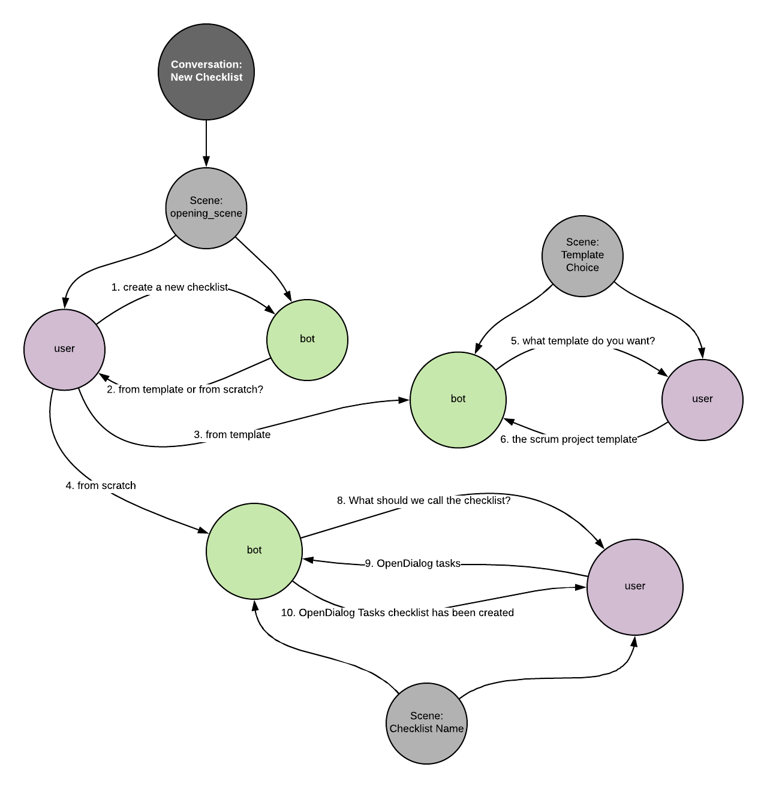
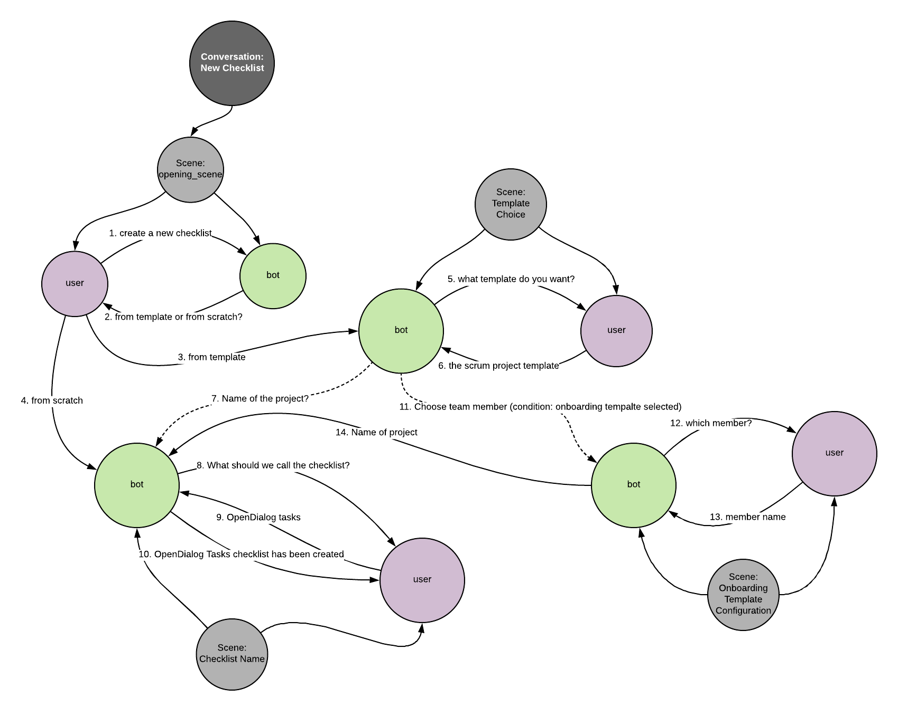

## Modelling conversational applications as Electronic Instututions

In OpenDialog conversational applications are modelled as _electronic institutions_ (EIs). 

An EI is "an organisational structure for coordinating the activities of multiple interacting agents". 

It mimics the concept of a conventional institution, as a space for coordinating the activities of individuals and transposes and evolves those concepts to fit the needs of a digital setting.  The abstraction of an EI, and the semantics it offers, provides the conceptual framework for capturing the activities of interacting agents in a conversational setting and describe them in a consistent and coherent way. 

> In OpenDialog _every_ participant, from bots to human users, is modelled as an agent participating in an EI. We use the same concepts and abstractions for both throughout giving us a *coherent* model of the system through a common set of concepts. 

Before we go on to the specifics of EIs and how we use them, there are four core characteristics that are worth highlighting as they underpin the overall design and approach of EIs. 

### An EI models social activities

The agents in our EI need to cooperate and coordinate to achieve their goals. The bot needs to ask the right questions and the user needs to provide relevant information in order to further the overall goals. In designing the system we need to cater for how to make both the bot (or bots) and the human (or humans) aware of what role they are playing in a given situation and what the expectations are of their role in that situation in order to further the overall goals. 

### An EI caters for decomposable activities

Activities are decomposable. A larger goal (e.g. order a pizza to be delivered to a specific location) can be decomposed into smaller activities (choose restaurant from which to order, define order, define location, deliver, pay, rate experience, etc). These smaller activities each require an exchange of _utterances_ in different stages with each stage achieving a specific goal. We call the different stages _scenes_. 

Scenes have a specific purpose and a well defined communication protocol. Networks of scenes represent the progress of a conversation through different phases with potentially different constraints and relevant context. As the conversation progress through scenes different _activities_ are also completed, each taking us closer to the final goal. 

### An EI is an open system

Openess from an EI perspective means that agents can enter or leave the system at any point. The design of conversations and the management of knowledge needs to cater for constant and unpredictable change. 

### An EI is a dialogical system

Activities within an EI are achieved through the exchange of utterances and the performance of activities. Activities can change or reveal states of the world the EI is in, either as a direct result of an utterance (e.g. the utterance "cook a pizza" will lead to the activity of cooking a pizza) or because an activity is required to be able to provide a reply to an utterance (e.g. the utterance "are all doors closed?" may lead to the activity of collecting information from all doors about their state).

## Representing conversations

An EI is made up by the sum of possible conversations that participants in the EI can have. A conversation captures some higher order goal. Let us consider, for the sake of an example, the interactions between a team as they organise for their daily tasks. 

The first goal to achieve is that of creating a checklist to capture the tasks that the team needs to work on. We can either start from a blank checklist or from a checklist template. 

Here is how we would represent a possible conversation to capture the interactions between bot and user.

There are a few things going on so let's break it down. 

### A conversation is represented as a directed graph.

The graph allows us to capture the different scenes, the participants in each scene and the exchanges between participants as edges between participant nodes. 

A conversation can develop within a single scene or it can branch out to different scenes. 

Each scene has a specific sub-goal, the sum of goals giving us the overall objective. 

The conversation starts with the user requesting a new checklist (Edge 1). The bot replies asking whether the checklist should be created from a template or from scratch. Depending on the user's response we either move to scene _Template Choice_ or to scene _Checklist Name_. 

If the user wants a blank checklist they will move the conversation to the _Checklist Name_ scene through the utterance represented on Edge 4, where the bot will ask for the name of the checklist (Edge 8), receive a response (Edge 9), provide confirmation (Edge 10) and the conversation completes.

If the user instead wants to select a template they move to the _Template Choice_ scene (Edge 3) to perform that task. 

#### Transitions

Now, you may have noticed we don't actually have a way of moving from the _Template Choice_ scene to the _Checklist Name_ scene. If the conversation remains as is after we have selected a Template we would not be able to assign it a name. 

We solve this issue by introducing a special type of connection between scenes - called a transition. Transitions are represented by a dotted line (Edge 7). The transition indicates the the follow-up action to the user's template choice is to move the entire conversation to the _Checklist Name_ scene. There the next utterance is the bot asking for the name of the checklist (Edge 8).

#### Conditional Transitions

Finally, let us consider the situation where we want to inject a different type of behaviour based on the type of template selected. Assume, for example, that when the team wants to collaborate on onboarding a new team member some tasks can be expetided by providing the name of the team member. In this case, instead of transitioning from the _Templace Choice_ to the _Checklist Name_ scene we want to introduce another option. This can be done be introducing conditional transitions. 

A conditional transition supercedes a default (or unconditional) transition if the conditions are met. As shown in the diagram below we introduce Edge 11. A conditional transition based on the type of the template chosen. This moves the conversation to the _Onboarding Template Configuration_ scene (nb: if the configuration process was complex we could transition to a separate conversation with its own set of scenes). The member name is collected (Edges 12 and 13) and the with Edge 14 we transition to the checklist name scene which remains the same. 

