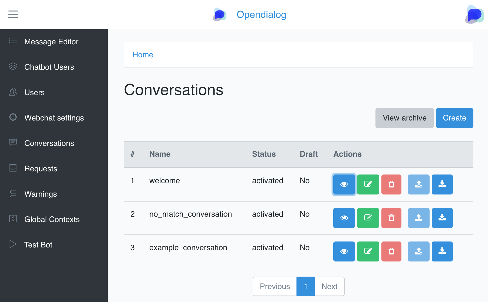
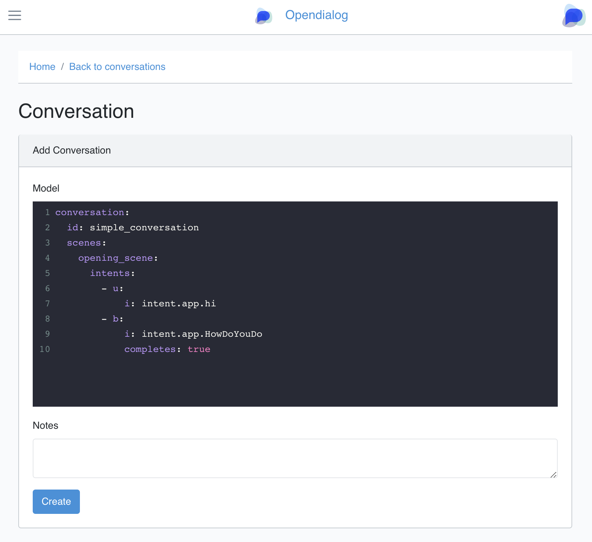
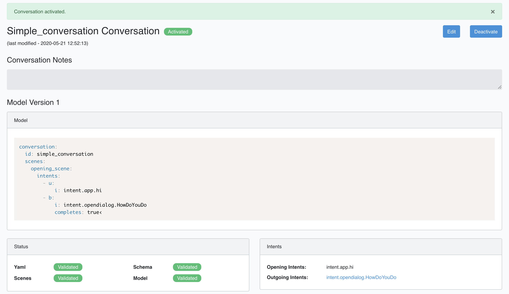
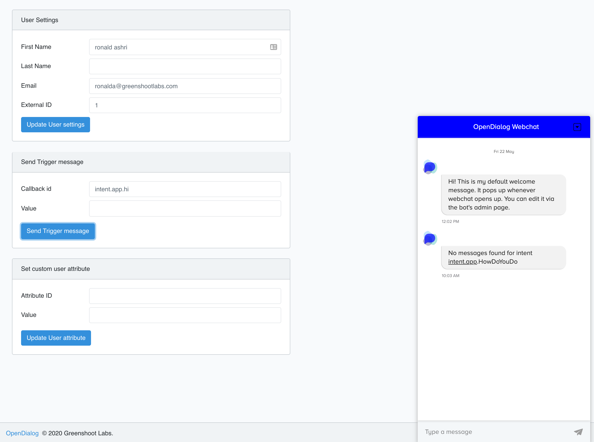

A conversation is the key building block of an OpenDialog conversation application. When a user interacts with an app the first thing we do is determine what conversation we should _instantiate_ in order to manage the interaction.

This happens by looking into all the _active_ conversations and all the opening intents of active conversations and choosing the conversation with a matching opening intent.  

A conversation has a name, which is used to identify the conversation in the admin interface and a _model_ which is the YAML representation of the conversation, follow OpenDialog's [conversational description language](cdl.md).

Conversations can have multiple _scenes_ and each scene can have multiple interactions. 

For the purposes of this guide, however, we will start with a simple conversation. Just a straightforward request-response. 


To create a conversation visit the Conversations listing page in the OpenDialog administration. In the image below you can see that there are three conversations and they are all _active_. OpenDialog keeps track of all changes to conversations and conversations can be active, deactive and there can also be a version of a conversation in draft mode. 

---


---

To create a new conversation click on "Create", this simply provides a very simple editor where you can add a conversation. 

---


---

Before saving a conversation OpenDialog runs a number of checks to ensure that it is a valid conversation and will provide relevant messages with any issues that it can identify. If it saves succesfully you can then activate the conversation which means that it will be considered the next time an utterance comes in from the user.

---


---

The conversation we are creating is a simple request-response. It is expecting the user to say something that will resolve to the `intent.app.hi` and if that is true then it will respond with `intent.app.HowDoYouDo`. 

This is the YAML for the conversation. 

```
conversation:
  id: simple_conversation
  scenes:
    opening_scene:
      intents:
        - u:
            i: intent.app.hi
        - b:
            i: intent.app.HowDoYouDo
            completes: true

```

If you go to the Test Bot page you can trigger the conversation by typing `intent.app.hi` in the Trigger Message area. This will send an event to webchat which is the equivalent of a user having sent an utterance with that intent. 

---


---

As you can see from the response, OpenDialog correctly identified that the appropriate outgoing intent should be `intent.app.HowDoYouDo` but did not find any message that could be matched to that intent. This is because we haven't created one yet. In the [next section](adding_a_message.md) we will do just that.