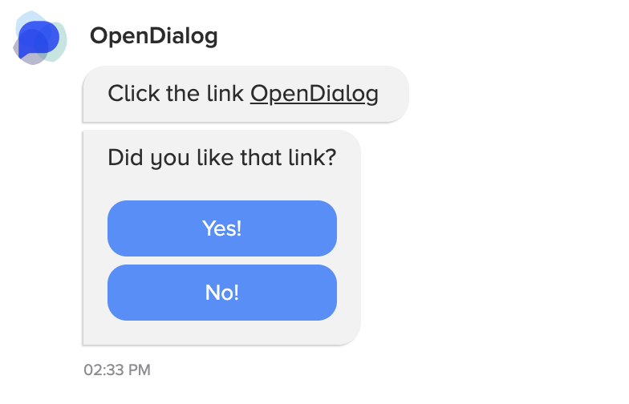

OpenDialog uses a custom XML style mark up language for describing message templates. The message mark up is platform agnostic meaning it will compile to the correct message format for all supported message platforms.
Not all message platforms support all message types, so in some cases the resulting message will differ between platforms. This page describes what is currently supported in the message template language with an example together with the resulting message on the webchat platform.

## Common to all messages

Each message template must be contained within a message block as follows:

```
<message>
</message>
```

Optionally, this can contain a `disable_text` property to turn off text responses from the user (for platforms that support this feature).

```
<message disable_text="true">
</message>
```

## Supported Message Types

We currently support 4 message types in the message builder:

### Text Message

A plain message with only text. Specially formatted links can also be included in the text body 

```
<text-message>{message-text}</text-message>
```

Where message text can contain links in the following format:

```

<link new_tab=true>
    <url>{url}</url>
    <text>{text}</text>
</link>

```

There is no support at the moment for any other formatting such as bold, italics etc

### Image Messages

Displays an image message. Optionally, the image can also be a link that can optionally open in a new tab if the `url` property is included.

```

<image-message>
    <src>{img_src}</src>
    <url new_tab={true|false}>{url}</url>
</image-message>

```

### Button Messages

Button messages allow you to provide the user a number of options to select as a response. Each button response will include a `callback_id` that will move the conversation forward.
Make sure that any `callback_id` you use in a button response is mapped to an intent in the interpreter engine config!

```
<button-message>
	<text>{button message text}</text>
</button-message>
```

#### Buttons
Each button message can have 1 or more buttons.

```
	<button>
	    <text>{text}</text>
	    <tab_switch>{true|false}</tab_switch>
	    <callback>{callback}</callback>
	    <value>{value}</value>
	</button>
```

`tab_switch` indicates that the button should switch the user to the 'comments' tab and can be used in place of a `value` and `callback_id`

The `value` property should be in the format `{attribute_name}.{value}` (eg age.18). This will be interpreted by OpenDialog which will create an attribute with the given name and store it in the user context.
Remember to register the attribute name in the context engine config otherwise it will resolve to a `StringAttribute` by default.

### Empty Messages

This is needed so an intent can have a matching template that doesn't result in a message being sent to the user. This may not be supported on all platforms


```

<empty-message/>

```


## Example

This is an example messages template

```xml
<message disable_text="true">

    <text-message>

        Click the link

        <link new_tab="true">

            <url>www.opendialog.ai</url>

            <text>OpenDialog</text>

        </link>

    </text-message>

    <button-message>

        <text>Did you like that link?</text>

        <button>

            <text>Yes!</text>

            <callback>link_response</callback>

            <value>link_answer.yes</value>

        </button>

        <button>

            <text>No!</text>

            <callback>link_response</callback>

            <value>link_answer.no</value>

        </button>

    </button-message>

</message>

```

When rendered in the webchat widget, it would look like this:

