In OpenDialog the aim for message markup is to provide a single way of writing messages that will then be automatically translated into the appropriate format for the frontend platform that should receive and transmit the message to the user. 

OpenDialog uses a custom XML style markup language for describing message templates. Not all message platforms support all message types, so in some cases the resulting message will differ between platforms. This page describes what is currently supported in the message template language with an example together with the resulting message on the webchat platform.

## Common to all messages

Each message template must be contained within a message block as follows:

```xml
<message>
</message>
```

### Disabling Text Input
The message element can optionally contain a `disable_text` property to turn off text responses from the user (for platforms that support this feature).

```xml
<message disable_text="1">
</message>
```
Example messages with user text enabled and then disabled.

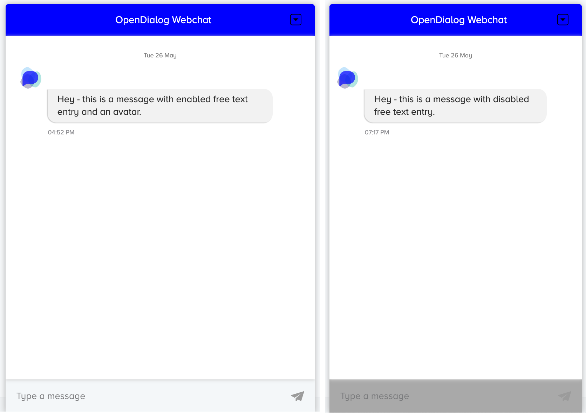


## Supported Message Types

We currently support several message types in the message builder:

### Text Message

A plain message with only text. Specially formatted links can also be included in the text body 

```xml
<message>
<text-message>{message-text}</text-message>
</message>
```


#### Example

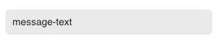

```xml
<message>
  <text-message> 
    Hello, this is a text message.
  </text-message>
</message>

```

Messages can also contain URLs in the text - that will linkified and there is also support for an explicit link at the end of a message. 

```xml
<message>
    <text-message> 
      You can have a link straing in text like this: hey go to greenshootlabs.com or you can do this:
      <link new_tab="true">
        <url>https://docs.opendialog.ai</url>
        <text>Read the OpenDialog Docs</text>
      </link>
  </text-message>
</message>
```

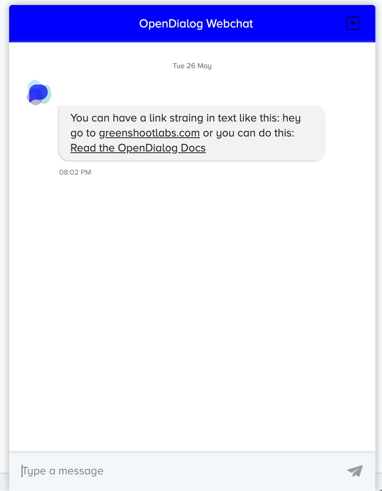


Links like `greenshootlabs.com` in the message text will be turned to links as well. 

There is no support at the moment for any other formatting such as bold, italics etc


### Image Messages

Displays an image message. Optionally, the image can also be a link that can optionally open in a new tab if the `url` property is included.

```xml
<message>
    <image-message>
        <src>{img_src}</src>
        <url new_tab="{true|false}">{url}</url>
    </image-message>
</message>
```

#### Example

```xml
<message>
    <image-message> 
      <src>https://docs.opendialog.ai/img/od-logo-with-credit.jpg</src>
      <url new_tab="true">https://docs.opendialog.ai</url>
    </image-message>
</message>
```

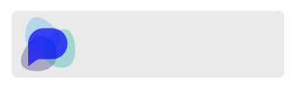

### Button Messages

Button messages allow you to provide the user a number of options to select as a response. The basic mark up is:

```xml
<message>
    <button-message clear_after_interaction="true|false">
	   <text>{button message text}</text>
        <external>true|false</external>
    </button-message>
</message>
```

Setting the `external` property to true results in a the message buttons appearing outside of the button message (this defaults to false if not set).

Setting the `clear_after_interaction` property to false means that the buttons will remain visible to the user after being interacted with

#### Buttons
A button message can contain 1 or more buttons for the user to interact with (some platforms have different restrictions on the number of buttons per message)
Each button must define a `text` element to specify the text that should be shown to the user.

OpenDialog has built in support for 4 types of button:

##### Callback buttons

Callback buttons will send  a `callback_id` (and optionally a `value`) when interacted with by the user that will move the conversation forward.
Make sure that any `callback_id` you use in a button response is mapped to an intent in the interpreter engine config.

```xml
    <button>
        <text>Callback Button</text>
        <callback>callback id</callback>
        <value>attribute_name.attribute_value</value>
    </button>
```

Values can be optionally set on callback buttons to add some extra context to the button response. The format of button values is:

        attribute_name.attribute_value
        
where `attribute_name` should be the ID of an attribute that has already been defined in the system.

When passing through the Callback Interpreter, button values will be parsed and an attribute will be returned with the value set as per the button 

###### Example

Here is are examples of a message with one button and two buttons. Clicking on the button would cause that callback value to be sent back to OpenDialog which could then be matched with an incoming intent. 

```xml

<message>
    <button-message>
        <text> A bit of explainer text at the top </text>
        <button> 
          <text>Click me!</text>
          <callback>intent.app.startAConversations</callback>
        </button>
    </button-message>
</message>
```

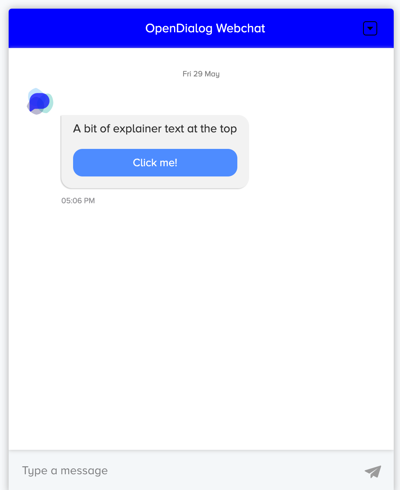


```xml

<message>
    <button-message>
        <text> A bit of explainer text at the top </text>
        <button> 
          <text>Click me!</text>
          <callback>intent.app.startAConversations</callback>
        </button>
        <button> 
          <text>Or click me!</text>
          <callback>intent.app.startADifferentConversations</callback>
        </button>
    </button-message>
</message>
```
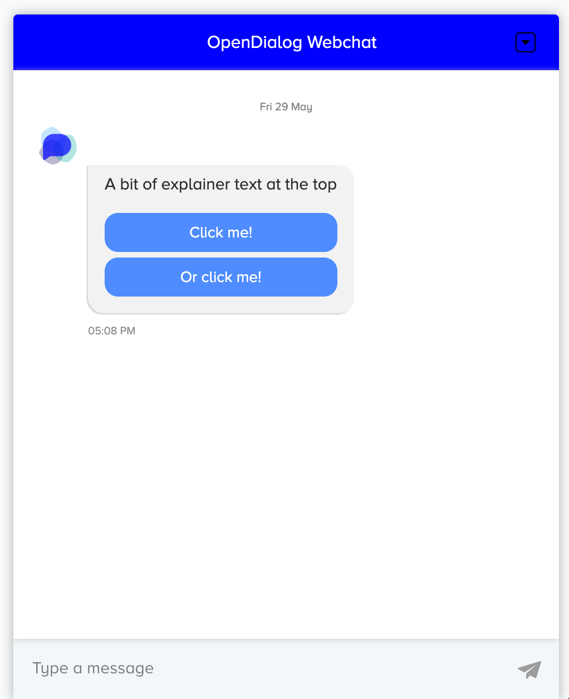

##### Link buttons

Links buttons are used to create links to other web pages. The `link_new_tab` element can be set to true to force the links to open in a new tab. If not set, links default to opening in the same tab

```xml
    <button>
        <text>Link Button</text>
        <link>http://example.com</link>
        <link_new_tab>true|false</link_new_tab>
    </button>
```

##### Example

```xml
<message>
    <button-message>
        <text> Here are some very useful resources for you. </text>
        <button> 
          <text>Wikipedia</text>
          <link>https://wikipedia.org</link>
          <link_new_tab>true</link_new_tab>
        </button>
        <button> 
          <text>W3C</text>
          <link>https://w3.org.org</link>
          <link_new_tab>true</link_new_tab>
        </button>
    </button-message>
</message>
```

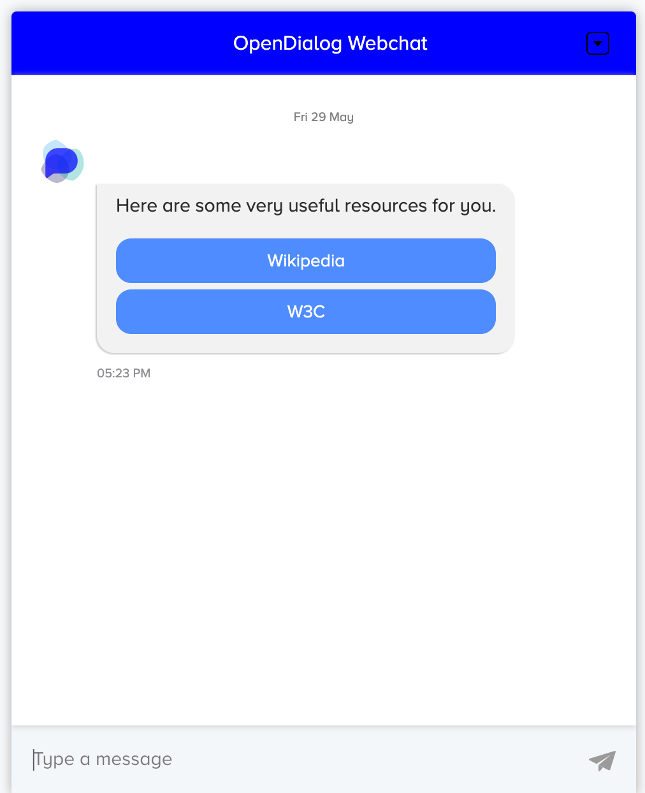


##### Click to Call buttons

Click to call buttons are used to create buttons for telephone numbers. They created a standard format `tel:` link that depending on the user's current device and platform will start a phone call to the number given 

```xml
    <button>
        <text>CLick to Call</text>
        <click_to_call>02079460000</click_to_call>
    </button>
```

##### Tab Switch buttons

Tab Switch buttons should only be used for the OD Webchat platform in conjunction with comments and indicates that the button should switch the user to the 'comments' tab

```xml
<button>
   <text>Tab Switch</text> 
   <tab_switch>true</tab_switch>
</button>
```

##### Button Types

Buttons can be defined with a `type` that can affect how they are displayed as a button on screen. Types are added as properties of the button like this:

```xml
<button type="{type}">
    <text>Click me!</text>
    <callback>intent.app.startAConversations</callback>
</button>
```

There are currently 2 types that can be used:

- `skip` -  If a button in an `external` button message has type of `skip`, it will appear below the other buttons with a different appearance. This can be used in conjunction with other messages to allow a user to skip past an intent
- `inline` - If a button in a standard button message (not `external`) has a type of `inline`, it will appear along with the button message text, inside the chat bubble.

---

An example outgoing intent with 2 button messages, 1 external 1 not showing different button types:


---

### Rich messages

Rich messages allow for more control around message content and how it is displayed to the user. They can be thought of like 'card' style messages and contain any of the following elements in combination:

* Title
* Subtitle
* Text
* Image
* Buttons

Where buttons can be any of the buttons described above. 

```xml
<rich-message>
    <title>Title</title>
    <subtitle>Subtitle</subtitle>
    <text>Text</text>
    <image>
        <src>image_src</src>
        <url new_tab="true|false">www.example.com</url>
    </image>
</rich-message>
```

#### Example

```xml
<message>
    <rich-message>
        <title>Rich Message</title>
        <subtitle>With a subtitle</subtitle>
        <text>Some engaging text</text>
        <image>
            <src>https://docs.opendialog.ai/img/od-logo-with-credit.jpg</src>
            <url new_tab="true">https://docs.opendialog.ai</url>
        </image>
    </rich-message>
</message>
```
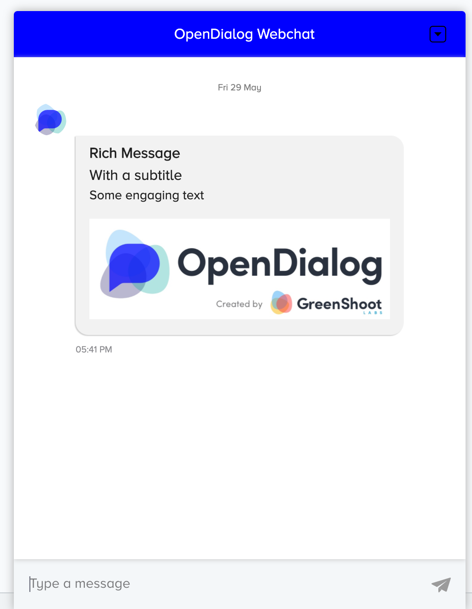


### Form messages

Form messages allow for user to input data in standard web form rather than text entry. When submitted, the values of the entered by the user are sent back along with the defined `callback` 
All form messages must contain the following elements:

```xml
    <form-message>
       <text>Text</text>
       <submit_text>Submit Text</submit_text>
       <callback>Callback</callback>
       <auto_submit>true|false</auto_submit>
    </form-message>
```

Here, the `text` value is shown at the top of the form message and the `submit_text` value is shown on the form submit button.
When `auto_submit` is set to true, the form will automatically be submitted when the user selects a value. This works best when just 1 element is added to the form
 
Optionally, the form message can contain a cancel button. This allows the user to tell the bot they do not want to submit the form. When clicked, the value of `cancel_callback` is sent. The cancel button can be added to a form message with the following mark up:

```xml
<form-message>
    <cancel_text>Text</cancel_text>
    <cancel_callback>Callback</cancel_callback>
</form-message>
```  

#### Elements

Form messages have support for a number of different elements (matching what is possible in a standard HTML form). All elements are defined in the same way, and there is no limit to how many can appear on a form message.

Each element must define a `type` and `display`, and can optionally define `required` and `default_value`. If required is set to true, the form cannot be submitted unless the field has a value.

```xml
<element>
    <element_type>textarea|text|number|email|select|auto_complete_select|radio</element_type>
    <display>Display Name</display>
    <required>true|false</required>
    <default_value>Default Value</default_value>
</element>
```

When using `radio` or `select` elements, you must define an `options` block giving the options to be presented in the radio list or select element:

```xml
<element>
    <options>
      <option>
        <key>Key</key>
        <value>Value</value>
      </option>
    </options>
</element>
```

The `email` element type acts just like a `text` element, but on submission, is validated to ensure it is formatted like an email address

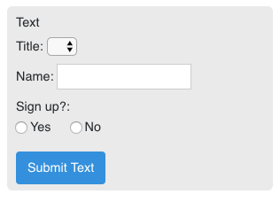

This form message example was created with the following XML:
```xml
<message>
    <form-message>
        <text>Text</text>
        <submit_text>Submit Text</submit_text>
        <callback>Callback</callback>
        <auto_submit>false</auto_submit>

        <element>
            <element_type>select</element_type>
            <name>title</name>
            <display>Title</display>
            <options>
                <option>
                    <key>mr</key>
                    <value>Mr.</value>
                </option>
                <option>
                    <key>mrs</key>
                    <value>Mrs.</value>
                </option>
                <option>
                    <key>other</key>
                    <value>Other</value>
                </option>
            </options>
        </element>

        <element>
            <element_type>text</element_type>
            <name>name</name>
            <display>Name</display>
        </element>

    </form-message>
</message>
```

### Empty Messages

This is needed so an intent can have a matching template that doesn't result in a message being sent to the user. This may not be supported on all platforms.
Empty messages can be useful to add to intents that we want to match for a user, but only send a message if certain conditions are met - for example using the standard `intent.core.welcome` to only send a message if the user was seen more than once.

```xml
<empty-message/>
```

### List messages

List messages allow for multiple messages be be combined into a single message for the user that is displayed as a carousel that users can scroll between. These are good for displaying multiple search results or related items.

List messages work well together with rich messages, but can be used as a wrapper for any messages types.

The only option available for list messages is `view-type`. This can either be `vertical` (default) or `horizontal`

Note - messages with very different sizes may not display well in a horizontal carousel

```xml
<list-message list_type="horizontal">
    <text-message>{text_message}</text-message>
    <image-message>{image_message}</image-message>
    <rich-message>{rich_message}</rich-message>
</list-message>
```

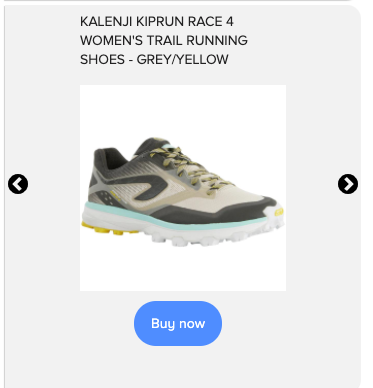

#### Date Picker messages

These allow the user to enter a date by selecting day, month and or year. Each of these fields can be defined as required meaning the message cannot be submitted unless the user has entered a value.

The `min_date` and `max_date` fields restrict the dates that are shown to the user so that what they submit is always within that range. The dates provided should be ISO date format containing at least the year, or just the word `today`.

```xml
<date-picker-message>
    <text>{message text}</text>
    <callback>{callback}</callback>
    <attribute_name>{attribute name}</attribute_name>
    <submit_text>{submit text}</submit_text>
    <day_required>true|false</day_required>
    <month_required>true|false</month_required>
    <year_required>true|false</year_required>
    <max_date>today|yyyy-mm-dd|yyyy-mm|yyyy</max_date>
    <min_date>today|yyyy-mm-dd|yyyy-mm|yyyy</min_date>
</date-picker-message>
```

---
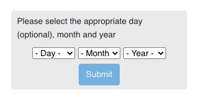

--- 


#### Autocomplete message

The autocomplete message is used to create an input that will offer suggestions to a user as they start typing. This message is supported by an API that should accept a query string and respond with an array of items to show in the JSON format below: 

```json
[
  {
    "name": "item1"
  },
  {
    "name": "item2"
  },
  {
    ...
  }
]
```

The message XML accepts a number of options that help the webchat component know how to construct the query to send to the API:

+ `options-endpoint.url` - The URL of the API to hit. This can be relative or absolute. It is often a good idea to create a local API proxy route in your OD application to be able to format responses from external sources.
+ `options-endpoint.params` - Each param in here will be added to the API url as query parameters in the format `?{name}={value}`.
+ `options-endpoint.query-param-name` - This field specifies the name to be used for the `query` query param. The value of the query param will be all characters that the user has started typing in the auto-complete box.

So in the example below, each time the user entered a character into the input field, the following GET request would is made to fetch the next set of suggestions

        /api/v4/products?name=value&query={}
        
There are 2 text type fields `text` which will appear when the message starts showing and `placeholder` which shows in the message input box before a user starts typing

```xml
  <autocomplete-message>
   <title>{text}</title>
   <callback>{callback}</callback>
   <submit_text>Submit</submit_text>
    <options-endpoint>
      <url>/api/v4/products</url>
      <params>
        <param name="name" value="value" />
      </params>
      <query-param-name>query</query-param-name>
    </options-endpoint>
    <attribute_name>ProductName</attribute_name>
    <placeholder>Start typing</placeholder>
  </autocomplete-message>
```

Autocomplete closed
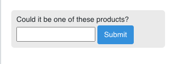


Autocomplete With Suggestions

--- 

### Full page messages

Rich and Form messages can also be presented as 'full page' messages. When full page messages are received, they will take over the entire chatbot screen (depending on what is supported by each platform). For webchat full page messages, the user input is also taken over.

#### Long Text messages

These messages are for a special case where a user is expected to enter more long form text and gives a larger space to do this.
In the case of OD webchat, a Long Text message will hide the current message list and display a large input space with the message text displayed above.

On submission, the user's input is sent as text along with the defined `callback`

Long text messages also allow for custom submit button text, confirmation text that is displayed to the user after submission and an optional character limit to limit what the user can enter

```xml
<long-text-message>
    <submit_text>Submit Text</submit_text>
    <callback>callback</callback>
    <initial_text>$this->initialText</initial_text>
    <placeholder>$this->placeholder</placeholder>
    <confirmation_text>$this->confirmationText</confirmation_text>
    <character_limit>$this->characterLimit</character_limit>
</long-text-message>
```

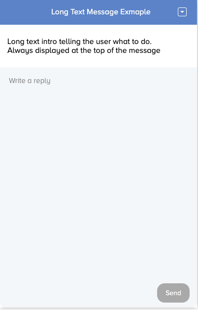

#### Full Page Rich messages

Full page rich messages are defined in exactly the same way as standard rich messages, but can optionally define a cancel button to allow the user to move on without interacting.

```xml
<fp-rich-message>
    <title>Title</title>
    <subtitle>Subtitle</subtitle>
    <text>Text</text>
    <image>
        <src>image_src</src>
        <url new_tab="true|false">www.example.com</url>
    </image>
    <cancel_text>Text</cancel_text>
    <cancel_callback>callback</cancel_callback>
</fp-rich-message>
```

#### Full Page Form messages

Full Page Form messages are defined in exactly the same way as form messages, but with a different element name:

```xml
    <fp-form-message>
       <text>Text</text>
       <submit_text>Submit Text</submit_text>
       <callback>Callback</callback>
       <auto_submit>true|false</auto_submit>
    </fp-form-message>    
```

### Special Messages

The messages below do not act like standard messages that appear in a message list and history, but perform 

### CTA messages

CTA messages are used to display content in the minimized chatbot and will only work with the OpenDialog webchat platform. Each time a CTA message is sent, the CTA text in the minimized chatbot header is updated. 

CTA messages can only contain text

```xml
<cta-messsage>
    {text}
</cta-messsaeg>
```
---


---


### Hand to Human messages

Hand to human messages are intended to be used to inform OpenDialog that the handling of chat has been taken over by another channel (typically a human). In OpenDialog webchat, this means that new messages sent by the user are not sent to the `incoming/webchat` endpoint, but are handled by an external system.

> Documentation for handling hand-to-human messages is being developed.

Hand to human messages contain a number of `data` elements that have a unique name specifying what they are for. This way, any custom data payload can bve sent with hand to human messages

```xml
<hand-to-human-message>
    <data name="{name_attribute}">{value}</data>
</hand-to-human-message>
```

### Meta messages

Meta messages are designed to allow the incoming message to have an effect on the conversational interface. There are a number of directives.
Each meta message is made up of a number of `data` attributes defined as below:

```xml
  <meta-message>
    <data name="textLimit">50</data>
    <data name="progressPercent">10</data>
    <data name="progressText">Getting Started</data>
  </meta-message>
```

The supported data attributes at the moment are:

- textLimit - imposes a limit on the text input to only allow a user to enter a capped number of characters
- progressPercent - updates the progress bar at the top of the webchat bot to the percentage provided
- progressText - updates the progress bar text at the top of the webchat bot to the value provided
- teamName - Updates the current team name of the bot

Meta Messages can be placed anywhere in a message template and will have the same effect

---
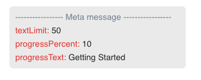

--- 